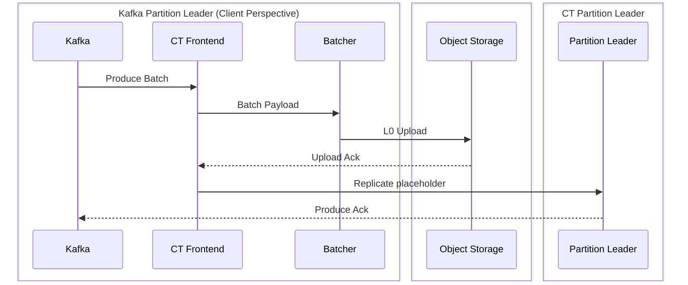

### Missing bits

* In the write path we should populate batch cache with `raft_data` batches
  instead of `ctp_placeholder` batches. Currently, the `ctp_placeholder` batches
  are replicated and so they're added to the batch cache. If we want low to
  achieve low latency for tailing consumers we need to make sure that they're
  reading from the batch cache.
* Reader caching. Currently, the code just consumes from the partition and then
  creates a `placeholder_extent` for every `ctp_placeholder` batch. Then the
  extent gets materialized (which involves expensive I/O). The data pulled by
  the `placeholder_extent` contains information that belongs to different NTPs
  but the reader only uses one that belongs to the NTP from which it's reading
  from. We need to cache L0 objects in memory so the data will be reused.
* Resource usage limitations. There should be a mechanism to limit memory use,
  inbound and outbound network and disk bandwidth. This will probably look like
  a per-shard token bucket for every resource. We should also limit retries in
  case of errors in a centralized way (circuit breaker or token bucket).
